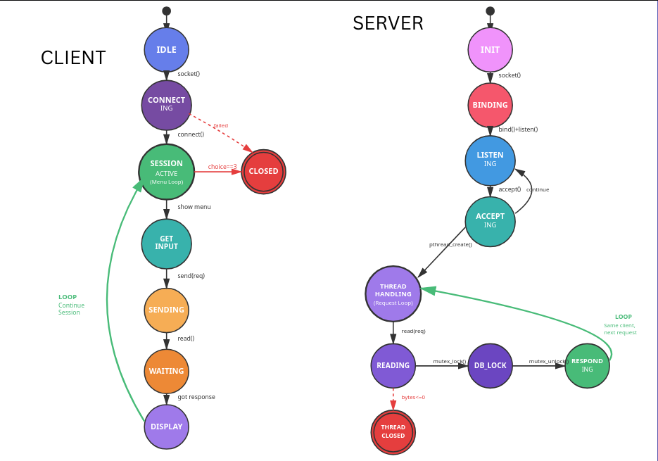

## Build Instructions

### Option 1: CMake 
```bash
# Using the build script
./build.sh

# Or manually:
mkdir build
cd build
cmake ..
make

# Executables will be in build/bin/
```

### Option 2: Direct Make
```bash
make

# This creates ./server and ./client
```

### Option 3: Manual Compilation
```bash
# Compile server
gcc -Wall -Wextra -std=c99 -o server server_improved.c -lpthread

# Compile client
gcc -Wall -Wextra -std=c99 -o client client_improved.c
```

## Running

**Terminal 1 (Server):**
```bash
./build/bin/server
# or
./server
```

**Terminal 2 (Client):**
```bash
./build/bin/client
# or
./client
```

## Usage

Client menu:
1. Register New User - Create a new license (ID 0-99)
2. Check License Status - Verify existing license
3. Exit - Close connection

## Features
- Persistent TCP connections 
- server multi threaded
- Thread-safe db access with mutex locks


